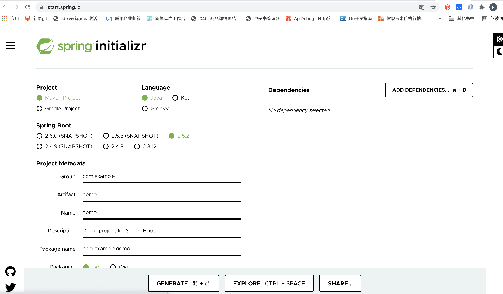

## 一、使用start.spring.io创建

### 1、创建

* 需要什么组件可以在dependencis中选择，如果是web项目可以选择web，可以选择redis等。
* 定义项目名称和包名

### 2、开发

下载下来然后用idea打开。web项目开发一个接口。

~~~java
package com.zhangkui.springDemo1;

import org.springframework.web.bind.annotation.RequestMapping;
import org.springframework.web.bind.annotation.RestController;

//如果是http接口，实现RestController注解就行。其他的工作交给了这个注解底层来实现。
@RestController
public class PlanInfoRequest {

  //http接口需要指定url地址。使用requestMapping就行。
    @RequestMapping("/plan")
    public String planInfo(){
        return  "plan";
    }
  
   @GetMapping("id")
    public String PlanInfoById(){
        return "plan_info";
    }
}

~~~

* http请求类型包括GET、POST、PUT、DELETE 。在spring中如果不知道是需要什么类型，就用request
  * GetMapping、PostMapping、DeleteMapping、PutMapping。合起来就是RequestMapping

### 3、使用maven进行打包

maven是一个java的包依赖管理工具。在项目编译的时候会把包的项目依赖组件进行下载。

maven打包jar

~~~shell
mvn clean package -Dmaven.test.skip
~~~

