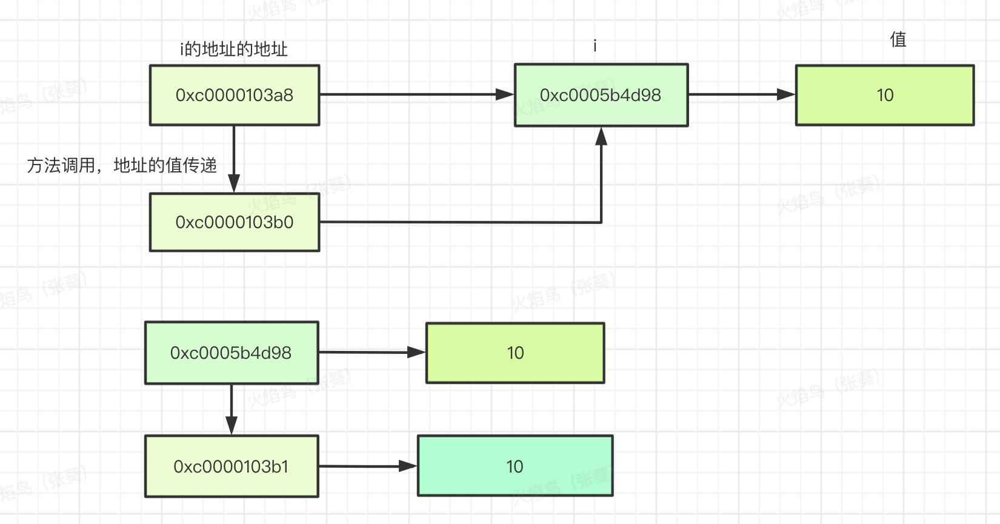
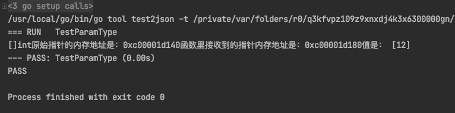
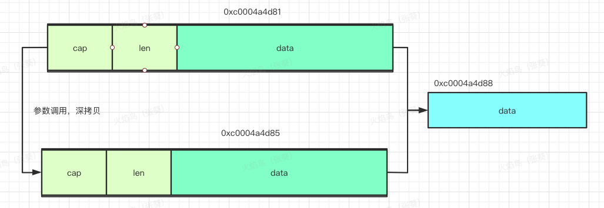
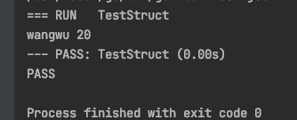

## <font color=red>go语言在参数调用的时候到底是传值还是传引用呢？</font>


​	这个是学习编程的时候最让人头大的一个问题，而且也是面试中经常被问起来的知识点。那在go语言中，到底是传值还是传引用。

------

[TOC]


## 一、传值和传引用

1. 如果在方法的调用中，实参和形参的地址不一样了，发生了深拷贝，就是传值。也就是说重新生成了一个变量，用在了这个新的方法中。
2. 传引用就是在向调用方法传递参数之后，形参和实参的地址都是一样的，只发生了前拷贝；也就是说只是产生了一个新的地址指向了原来的值。


## 二、简单类型传值验证

```go
package test

import (
	"fmt"
	"testing"
)

func TestParamType(t *testing.T)  {
	i := 10
	ip := &i

	fmt.Printf("i的地址是：%p",ip)

	fmt.Printf("原始指针的内存地址是：%p",&ip)
	modify(ip)

	fmt.Println("值是：",i)

}

func modify(ip *int)  {
	fmt.Printf("函数里接收到的指针内存地址是：%p",&ip)
	*ip = 12
}
```



从结果可以看出来，不管是具体的值传递还是指针的传递，都是真实的值传递。

### <table><tr><td bgcolor=PowderBlue><font color=red>为什么通过指针传递就能改变原来的值呢</font></td></tr></table>

* 从图中可以看到，如果使用指针传递参数，深拷贝了一份指针地址，通过修改指向值的地址，进而修改了值。
* 如果是直接使用值传递，没有使用指针传递，发现修改的值只是拷贝出来的那一份的值，原始数据并没有发生改变。

## 三、复杂类型的传递

### 1、在go语言中复杂的类型有哪些？

* struct
* map
* channel
* splice

```go
package test

import (
	"fmt"
	"testing"
)

func TestParamType(t *testing.T)  {
	i := []int{1}

	fmt.Printf("%T",i)
	fmt.Printf("原始指针的内存地址是：%p",&i)
	modify(i)

	fmt.Println("值是：",i)

}

func modify(ip []int)  {
	fmt.Printf("函数里接收到的指针内存地址是：%p",&ip)
	ip[0] = 12
}
```

结果：



从结果可以看出来，切片也是传值，因为地址不一样了。


<font color=red>问题：为什么在调用方法中改了切片，原始值也生效了？</font>

```go
package test

import (
	"fmt"
	"testing"
)

func TestParamType(t *testing.T)  {
	i := []int{1}

	fmt.Printf("%T",i)
	fmt.Printf("原始指针的内存地址是：%p",&i[0])
	modify(i)

	fmt.Println("值是：",i)

}

func modify(ip []int)  {
	fmt.Printf("函数里接收到的指针内存地址是：%p",&ip[0])
	ip[0] = 12
}
```


从这个结果可以看出来，切片的首位置的地址是一样的，也就是说切片深拷贝了一个出来，但是切片底层的数组是指针类型的。




### 2、结构体

结构体自身和其他数据类型都一样，都是值拷贝。但是有一点特殊的是，结构体是由多个普通类型或者复杂类型组合起来的，其中哪些元素是用的指针，就会是地址的深度拷贝，所以修改指针就会对所有他指向的结果产生影响。

```go

func TestStruct(t *testing.T) {
	var s Student
	name :="zhangsan"
	s.name = &name
	s.age = 20
	modifyStruct(s)
	fmt.Println(*s.name,s.age)
}

func modifyStruct(s Student)  {
	s.age = 29
	*s.name = "wangwu"

}

```




------

### 

## <font color=red>总结</font>

* 在go语言中方法调用，参数拷贝都是深拷贝。
* splice自身是深拷贝，他里面的data是指针类型，所以splice自身的修改也会作用于data
* 结构体中如果元素存在指针类型，一处修改会导致所有的生效。


### <font color=yellow>参考文献</font>

- [1][go语言类型传值](https://www.flysnow.org/2018/02/24/golang-function-parameters-passed-by-value.html)


