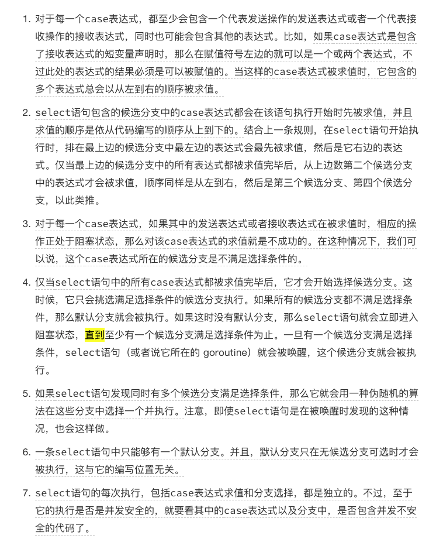

# 管道的使用

[TOC]


## 一、管道的类型

根据是否有缓冲将管道分为有缓冲的管道和无缓冲管道。


## 二、管道中数据的读取和写入

* 在读取有缓冲/无缓冲的管道的时候，如果管道中没有数据了， 还要读就会发生阻塞。
* 在写有缓冲的管道的时候，如果管道满了，写的时候就要阻塞。

```go
package test

import (
	"fmt"
	"testing"
	"time"
)

func TestChannel(t *testing.T) {
	channel1 := make(chan int)//创建一个有缓冲的int的通道
	
	go func(channel chan int) {

		time.Sleep(time.Second * 5)

		channel1 <- 10
	}(channel1)

	res := <- channel1

	fmt.Println(res)
}

```

### <font color=#00ffff>  </font><font color=red>Notice</font>

* 管道的写入和读取可以分布在不同的gorountine中
* 在读取阻塞期间，如果有一个协程向该协程写入了数据，这个阻塞就能正常执行。
* 如果一个进程在读取管道中数据的时候，阻塞了，之后这个管道没有数据写入，这个进程一直阻塞，永远不会被解封。


## 三、关于通道的panic

#### 1、如果关闭了管道，再向管道里面写数据会引发panic。这个是和有无缓冲没有关系的。

#### 2、如果要关闭一个已经关闭的channel，也会引起panic，关闭空的东西永远不会有结果。


## 四、永久阻塞

#### 1、 如果只定义了channel，没有make。这个channel就是nil的

#### 2、使用for和select一起使用，break只能跳出去select这一层，无法跳出for这一层


## 五、select使用

select是go专门为管道定制的一款工具。来判定那个管道目前那个能用，可以执行了。

```go

func TestSelect1(t *testing.T) {
	go func() {
		time.Sleep(time.Second * 2)
		res := <- getChan(1)
		fmt.Println(res)
	}()
	//time.Sleep(time.Second * 2)
	select {
	case getChan(0) <- getNumber(0):
		fmt.Println("The first candidate case is selected.")
	case getChan(1) <- getNumber(1):
		fmt.Println("The second candidate case is selected.")
	case getChan(2) <- getNumber(2):
		fmt.Println("The third candidate case is selected")
	//default:
	//	fmt.Println("No candidate case is selected!")
	}
}

func getNumber(i int) int {

	fmt.Printf("numbers[%d],value is %d\n", i,numbers[i])
	return numbers[i]
}

func getChan(i int) chan int {
	fmt.Printf("channels[%d],value is %d\n", i,channels[i])
	return channels[i]
}
```


```go

//这里定义的是有缓冲的管道，在小于这个容量的数据进入管道时候，不会发生阻塞，直接case生效。case都生效了，就会默认伪随机出一个进行执行。
//加入前面的是出于阻塞状态，后面有不处于阻塞状态的时候，就会去执行后面的。
//整个前提都需要case表示式计算完成之后才会去case具体的管道进行后面的操作
var channels = [3]chan int{
	make(chan int,2),
	make(chan int,2),
	make(chan int,2),
}

var numbers = []int{1, 2, 3}

func TestSelect1(t *testing.T) {
	select {
	case getChan(0) <- getNumber(0):
		fmt.Println("The first candidate case is selected.")
	case getChan(1) <- getNumber(1):
		fmt.Println("The second candidate case is selected.")
	case getChan(2) <- getNumber(2):
		fmt.Println("The third candidate case is selected")
	//default:
	//	fmt.Println("No candidate case is selected!")
	}
}

func getNumber(i int) int {

	fmt.Printf("numbers[%d],value is %d\n", i,numbers[i])
	return numbers[i]
}

func getChan(i int) chan int {
	fmt.Printf("channels[%d],value is %d\n", i,channels[i])
	return channels[i]
}
```




## 六、总结

管道的关闭要在发送者手里控制，要不一个接受者接受完了就关闭，其他的就无法接受了。

